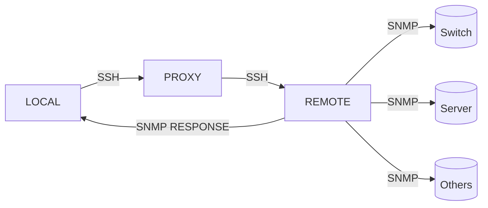

# JUMP-SNMP

Este software es una solución eficiente para realizar consultas SNMP a **_dispositivos remotos a través de un servidor intermediario mediante SSH_**. Con su capacidad para enviar trampas SNMP al servidor de registro remoto, el software es ideal para administradores de redes que necesitan obtener información de manera rápida y segura utilizando el protocolo SSH.



## Instalación

Clonar este repositorio [GitHub](https://github.com/metalpoch/jump-snmp)

```bash
git clone https://github.com/metalpoch/jump-snmp.git
```

Instalar dependencias

```bash
npm install
```

###### Es necesario que cada quipo contengan la llave primaria de cada servidor para una conexión sastifactoria.

## Variables de entorno

Este software requiere un fichero .env en la ruta raiz

```bash
PROXY_USER="<usuario intermediario>"
PROXY_HOST="<host intermediario>"
REMOTE_USER="<usuario remoto>"
REMOTE_HOST="<host remoto>"
PRIVATE_KEY="<llave privada SSH>"
```

## Licencia

[MIT](https://github.com/metalpoch/jump-snmp/blob/main/LICENSE)
